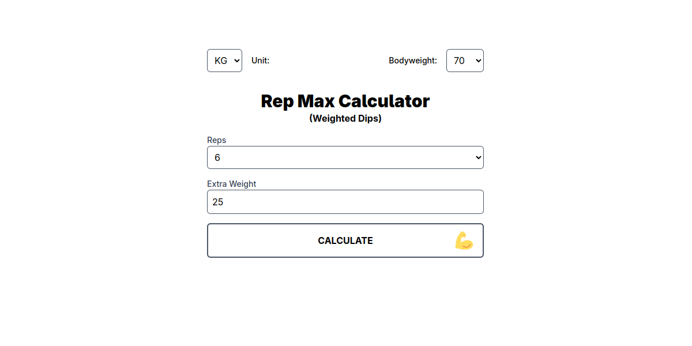

# DipMaxCalc

A calculator to estimate your one-rep max (1RM) and other rep maxes for weighted dips, with a fun strength level progression system.



## Features
- 🏋️ Calculate 1RM, 3RM, 5RM, 7RM, and 9RM for weighted dips
- ⚖️ Switch between KG and LB units
- 📊 Strength level progression system with 20 unique titles
- 💾 Session storage persistence for user inputs
- 📱 Mobile-friendly responsive design

## Installation
1. Clone the repository
```bash
git clone https://github.com/yourusername/weighted-dip-calculator.git
```

2. Install dependencies

```bash
npm install
```

3. Run the development server

```bash
npm run dev
```

## Usage

1. Select your preferred unit (KG/LB)

2. Input your bodyweight

3. Enter the extra weight you can lift

4. Select the number of reps performed

5. Click "Calculate" to see your estimated maxes and strength level

## Formula

The calculation uses a custom formula that factors in bodyweight:

```1RM = extra_weight + (bodyweight * reps / 30)```

This formula emphasizes bodyweight contribution to the movement compared to traditional barbell lift formulas.

## Strength Levels

20 progressive titles with KG/LB thresholds (5kg/10lb increments):

- Featherweight ➡️ Novice ➡️ Apprentice ➡️ Striker ➡️ Gladiator

- Warrior ➡️ Brawler ➡️ Vanguard ➡️ Titan ➡️ Champion

- Powerhouse ➡️ Juggernaut ➡️ Behemoth ➡️ Colossus ➡️ Herculean

- Monster ➡️ Overlord ➡️ Superhuman ➡️ Unbreakable ➡️ Legendary

Progress bar shows how close you are to the next level.

## Technologies

SolidJS - Reactive framework

@solid-primitives/storage - Persisted state

@tanstack/solid-form - Form management

TypeScript - Type safety

Vite - Build tooling

## License

MIT © Korab Doroci
